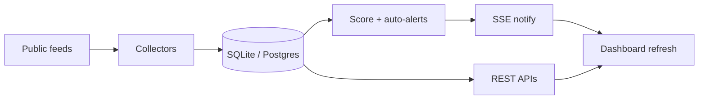

# Cyber Narrative Radar

Cyber Narrative Radar is a portfolio-grade cybersecurity self-starter project inspired by the public concept behind narrative-intelligence platforms such as Narravance and ChatterFlow, but adapted for cybersecurity early warning rather than trading.

## Portfolio presentation

**Pitch:** A local-first cybersecurity narrative intelligence MVP that turns public chatter into explainable early-warning alerts for watchlist organizations.

### What this project demonstrates

For hiring managers and technical leaders, this repo is evidence of end-to-end product and engineering judgment—not just a model demo:

- **Security / OSINT product sense** — frames early warning around cyber narrative types (ransomware, phishing, zero-days, supply chain, etc.) with an analyst workflow in mind
- **Full-stack delivery** — FastAPI + SQLAlchemy backend, React/TypeScript dashboard, Docker/Render/Railway deploy path
- **Explainable analytics over black-box AI** — deterministic scoring, TF-IDF + KMeans clustering, rule-based summaries; LLMs optional and off the critical detection path
- **Data pipeline discipline** — public/synthetic ingestion (RSS + seed data), normalized schemas, org/sector mapping, searchable/filterable alerts
- **Operator UX** — alerts with evidence, organization selection + trends, narrative explorer with cluster summaries
- **Ship readiness** — env-based config, CORS, Postgres URL normalization, deployment docs, and a repeatable demo checklist

### Recommended demo flow (5–7 minutes)

1. **Overview** — show KPIs (alerts, orgs, narrative clusters) and recent cluster activity  
2. **Alerts** — open a high-severity alert; walk through score, why-flagged reasons, and evidence posts; try search + category/org/source filters  
3. **Organizations** — search/filter the watchlist, select an org; show Detail (activity summary) and Trend (mention volume)  
4. **Narratives** — open Narrative Explorer; explain TF-IDF/KMeans cluster title, post count, rule-based summary, categories/orgs, and top posts  
5. **Close** — call out explainability (evidence + deterministic methods) and deployability (Render blueprint / Railway Docker API)

## Goal

Build a local-first MVP that:

- Ingests public cyber-related text data from safe sources such as RSS, Reddit, and synthetic chatter.
- Normalizes and enriches those records.
- Maps content to organizations, sectors, and cyber narrative categories.
- Detects unusual spikes and shifts in discussion.
- Creates explainable alerts with evidence.
- Displays alerts and drilldowns in a simple analyst dashboard.

## Why this project matters

This project demonstrates:

- Cybersecurity reasoning
- Applied NLP
- OSINT-style analysis
- Product thinking
- Dashboard design
- Explainable AI-assisted workflows

## MVP categories

- Data breach
- Ransomware
- Phishing / social engineering
- Zero-day / critical vulnerability
- Supply chain compromise
- Deepfake / disinformation cyber influence

## Proposed stack

### Backend
- Python 3.11+
- FastAPI
- SQLAlchemy
- Alembic
- PostgreSQL
- Redis
- Celery

### Analytics
- pandas
- scikit-learn
- sentence-transformers
- spaCy

### Frontend
- React
- TypeScript
- Tailwind CSS
- Recharts

### Local development
- Docker Compose

## Repo structure

```text
cyber-narrative-radar/
  backend/
    app/
      api/
      collectors/
      analytics/
      services/
      db/
      tasks/
      schemas/
    tests/
    requirements.txt
    Dockerfile
  frontend/
    src/
      components/
      pages/
      lib/
    package.json
    Dockerfile
  obsidian/
    Cyber Narrative Radar/
      00 Home.md
      01 Vision.md
      02 Architecture.md
      03 Data Sources.md
      04 Threat Taxonomy.md
      05 MVP Roadmap.md
      06 Portfolio Story.md
      Mind Map.md
  docker-compose.yml
  README.md
  AGENTS.md
  .cursor/
    rules/
      project.mdc
      python.mdc
      typescript.mdc
```

## MVP workflow

```text
Sources (RSS · CISA/KEV · NVD · Reddit · synthetic)
    → Ingest / normalize
    → Classify + CVE extract + score
    → Auto-alerts + SSE notify
    → FastAPI
    → React dashboard (Overview · Alerts · Org risk brief · Narratives)
```



## Phase plan

### Phase 1
- Scaffold backend and frontend
- Create Docker Compose
- Add placeholder API routes
- Add placeholder frontend pages
- Add Obsidian notes

### Phase 2
- Add models and schemas
- Add Alembic migration
- Add sample seed data

### Phase 3
- Implement ingestion
- Add RSS connector
- Add Reddit connector if feasible
- Add synthetic chatter generator

### Phase 4
- Implement analytics
- Add threat tagging
- Add entity mapping
- Add anomaly scoring
- Add explainable alerts

### Phase 5
- Build dashboard pages
- Add charts and drilldowns

### Phase 6 (complete — deployment + portfolio presentation)
- Environment-based backend config (`DATABASE_URL`, `FRONTEND_URL`, CORS)
- SQLite locally + lightweight PostgreSQL readiness (`postgres://` normalization, `psycopg2-binary`)
- Frontend `VITE_API_BASE_URL` + `.env.example`
- `render.yaml` (API + static frontend) and Railway-ready `backend/Dockerfile`
- README deployment instructions, demo checklist, and portfolio presentation
- Optional LLM summaries remain outside the critical detection path (future)

## Deployment

### Option A — Render (full stack blueprint)

Use the root `render.yaml` Blueprint to deploy both services:

1. Push this repo to GitHub/GitLab.
2. In Render: **New → Blueprint** and select the repo.
3. Render creates:
   - `cyber-narrative-radar-api` — FastAPI (`backend/`, uvicorn)
   - `cyber-narrative-radar-web` — Vite static site (`frontend/dist`)
4. Blueprint wiring:
   - Backend `FRONTEND_URL` ← frontend public URL (CORS)
   - Frontend `VITE_API_BASE_URL` ← API public URL (baked at build time)

After deploy, open the static site URL and confirm `/api/health` on the API service.

Optional: replace the default SQLite `DATABASE_URL` with Render Postgres in the API service settings for durable storage.

### Option B — Railway backend (stronger API option)

Railway is a strong choice when you want a containerized API with a durable disk or managed Postgres, then host the frontend separately (Render static, Netlify, Cloudflare Pages, etc.).

1. Create a Railway project from this repo.
2. Set the service root / Dockerfile path to `backend/` (uses `backend/Dockerfile`).
3. Configure env vars:
   - `FRONTEND_URL` — your deployed dashboard origin
   - `DATABASE_URL` — Railway Postgres connection string (recommended) or SQLite
   - `ENVIRONMENT=production`
4. Deploy; Railway sets `PORT` automatically (the Dockerfile already respects it).
5. Build the frontend with the Railway API URL:

```bash
cd frontend
cp .env.example .env
# set VITE_API_BASE_URL=https://your-railway-api.up.railway.app
npm install && npm run build
```

Serve `frontend/dist` on any static host, and keep `FRONTEND_URL` on the API pointed at that host.

### Useful env vars

| Variable | Where | Purpose |
|---|---|---|
| `DATABASE_URL` | Backend | SQLite locally; Postgres in production |
| `FRONTEND_URL` | Backend | CORS allowlist for the dashboard |
| `VITE_API_BASE_URL` | Frontend build | API origin baked into the client |
| `ENVIRONMENT` | Backend | `local` or `production` |
| `DEMO_LIVE_INTERVAL_MIN` / `MAX` | Backend (optional) | Cadence for `generate_live_demo` (default 20–30s) |
| `LIVE_INGEST` | Backend (optional) | Set `1` to run scheduled RSS ingest + scoring in the API |
| `LIVE_INGEST_INTERVAL_SECONDS` | Backend (optional) | Seconds between RSS runs (default `180`) |
| `AUTO_ALERT_MIN_SCORE` | Backend (optional) | Min 0–100 score to upsert auto-alerts (default `45`) |

### Optional scheduled RSS (Week 1)

Near–real-time public feeds without Celery — env-gated inside the API process:

```bash
cd backend
export LIVE_INGEST=1
export LIVE_INGEST_INTERVAL_SECONDS=180   # every 3 minutes
uvicorn app.main:app --reload --port 8000
```

- Status: `GET http://localhost:8000/api/ingest/status`
- Manual run: `POST http://localhost:8000/api/ingest/run`
- Leave `LIVE_INGEST` unset/`0` for normal usage (CLI ingest only)

Scoring also upserts `alert-auto-*` records when post scores clear `AUTO_ALERT_MIN_SCORE`.

### Week 2 — CISA / NVD + CVE extraction

Public advisory ingest (no scraping of private sites):

- **CISA RSS** advisories / alerts / current activity (via User-Agent-aware RSS fetch)
- **CISA KEV** JSON catalog (`source=cisa`)
- **NVD API 2.0** recent CVEs (`source=nvd`)
- **CVE ID extraction** into `posts.cve_ids` (also shown on alert evidence)

```bash
cd backend
python -m app.tasks.ingest_rss
python -m app.tasks.score_posts
```

Existing local DBs get a light `ALTER TABLE` for `cve_ids` on startup.

### Week 3 — Reddit + source mix

Official Reddit read path (public `.json` + User-Agent; optional app-only OAuth):

```bash
cd backend
# optional: export REDDIT_CLIENT_ID=... REDDIT_CLIENT_SECRET=...
python -m app.tasks.ingest_reddit
# or full pipeline (RSS + CISA/NVD + Reddit):
python -m app.tasks.ingest_rss
```

Disable Reddit: `REDDIT_ENABLED=0`.

Dashboard: Overview **Source mix** chart uses `GET /api/metrics/sources`.

### Week 4 — Org risk brief + deploy + recorded demo

- **Risk brief API:** `GET /api/organizations/{slug}/risk-brief`
- **UI:** Organization Detail → Risk brief (level, 24h vs baseline, narratives, CVEs, evidence, caveats)
- **Deploy:** `render.yaml` enables `LIVE_INGEST=1` (5‑minute cadence). After deploy, seed via Render Shell.
- **Recording outline:** [`docs/DEMO_SCRIPT.md`](docs/DEMO_SCRIPT.md)

```bash
# Local risk-brief check
curl -s http://localhost:8000/api/organizations/acme-logistics/risk-brief | python -m json.tool
```

### Optional live synthetic demo mode

To make the dashboard visibly update during a walkthrough (no external APIs):

```bash
# Terminal A — API
cd backend && uvicorn app.main:app --reload --port 8000

# Terminal B — seed once, then stream synthetic posts
cd backend
python -m app.tasks.seed_demo_data
python -m app.tasks.generate_live_demo
# Ctrl+C to stop
```

Posts are labeled `source=synthetic`. Leave this process stopped for normal RSS/seed-only usage.

## Demo checklist

- [ ] Backend healthy: `GET /api/health` returns `healthy`
- [ ] Seed or ingest data (local): `python -m app.tasks.seed_demo_data` then optional `ingest_rss` / `score_posts`
- [ ] (Optional) Live demo chatter: `python -m app.tasks.generate_live_demo` (Ctrl+C to stop)
- [ ] Alerts page loads with scores, evidence, search, and filters
- [ ] Organizations: search/sector filters work; selecting an org updates Detail (risk brief) + Trend
- [ ] Narratives: clusters show title, count, summary, orgs/categories, top posts
- [ ] Overview KPIs, source mix, and charts render without console errors
- [ ] CORS works between deployed frontend and API (`FRONTEND_URL` / `VITE_API_BASE_URL` set)
- [ ] Portfolio walkthrough ready: alert → org risk brief → narrative cluster explainability
- [ ] Optional: record Loom using `docs/DEMO_SCRIPT.md`
